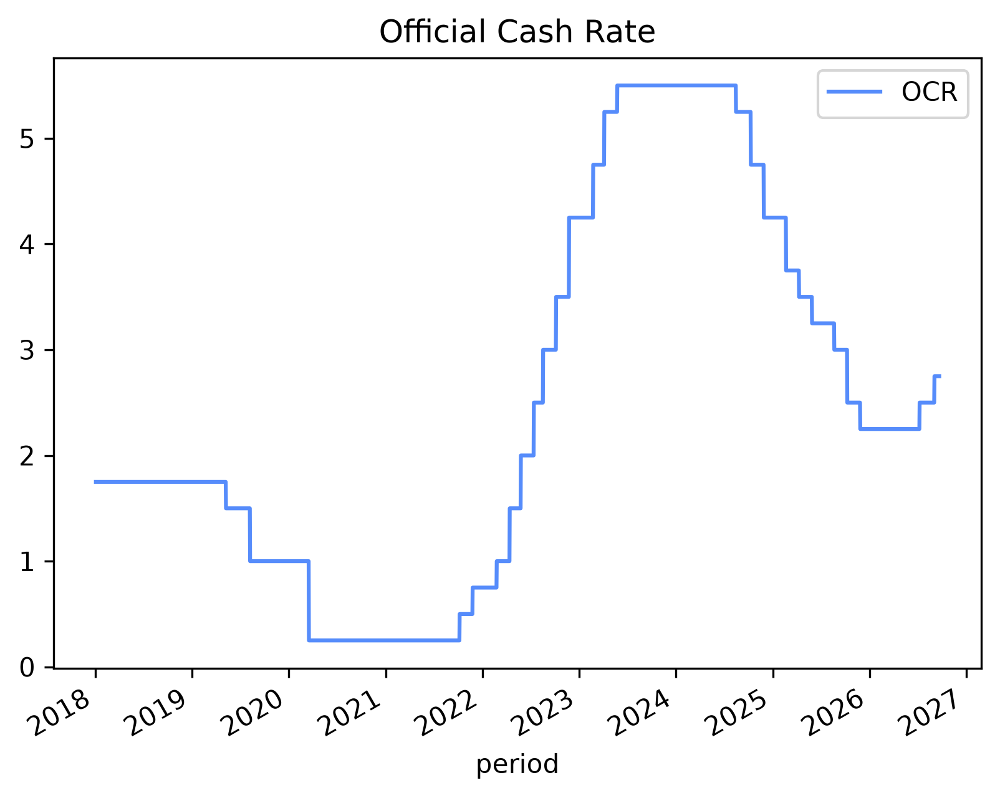
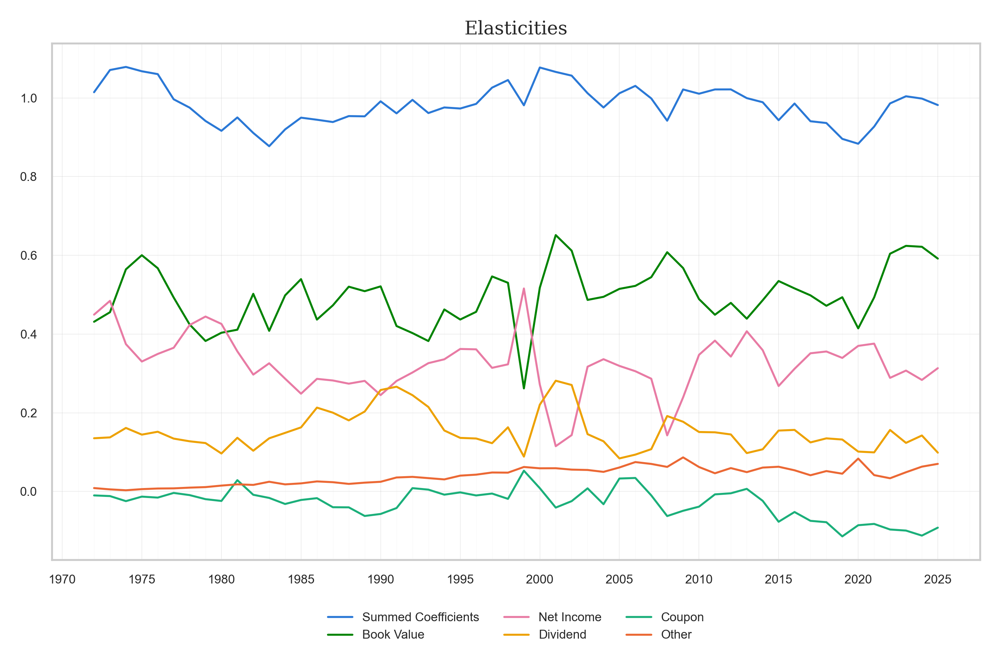
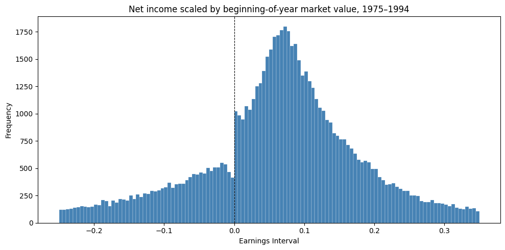
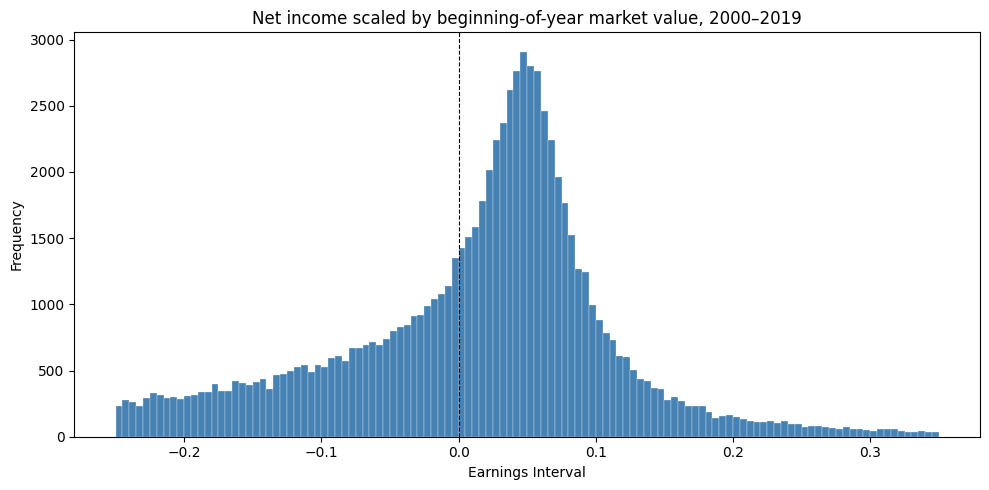
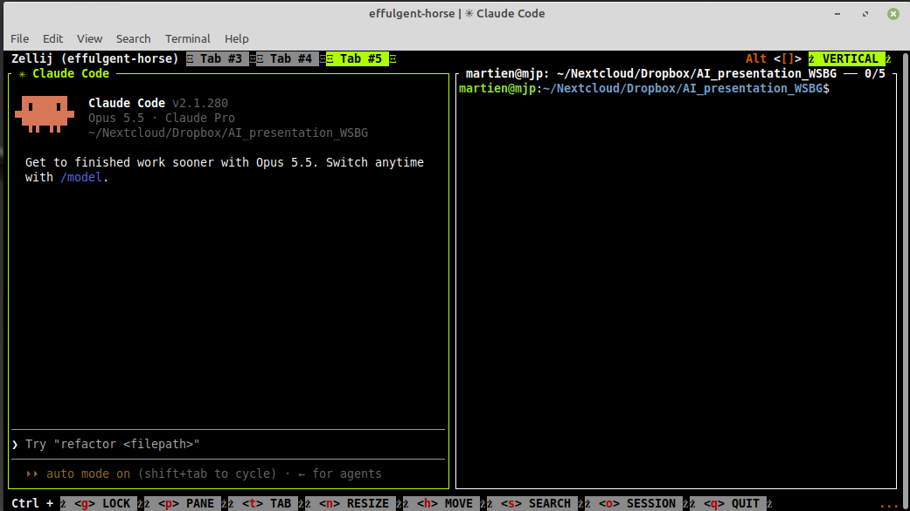
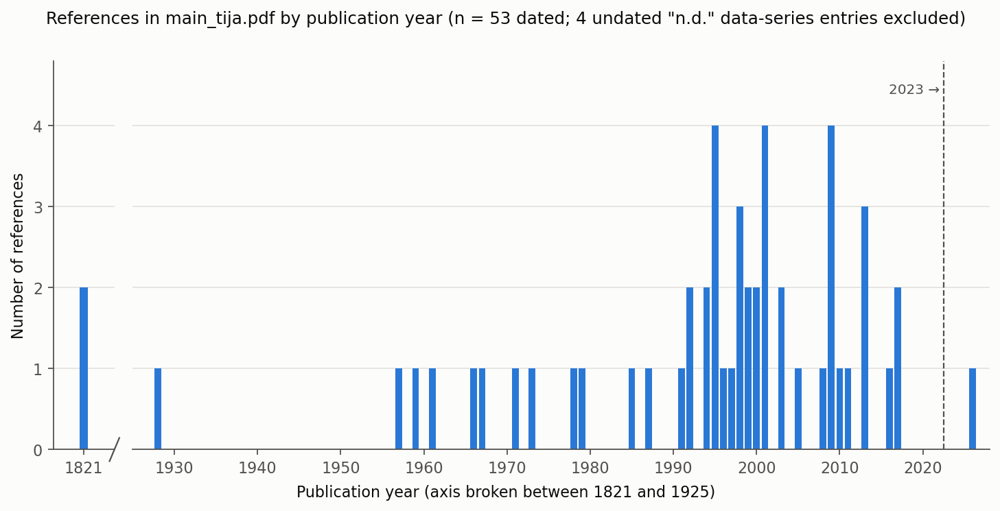
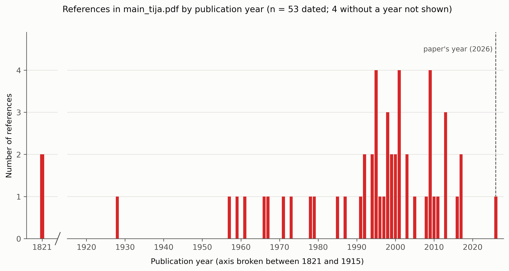

## {background-image="figures/opening_pic.png" background-size="contain" background-color="#fcfcfa"}

## Some of my own examples

## RBNZ API

::: {.subtitle-line}
In one weekend coded an [API](https://github.com/blucap/RBNZ_API) that pulls and tidies the [Reserve Bank's published statistics](https://www.rbnz.govt.nz/statistics/series/data-file-index-page). 60 tables, half a million rows. Daily updated.
:::

{fig-alt="Step chart of New Zealand's Official Cash Rate from 2018 to 2027, near zero through 2021, rising to a peak above 5% in 2023-24, and falling back toward 2.5% by 2026." width="750" fig-align="center"}

::: {.source}
One query against my own RBNZ API — the Official Cash Rate series, no spreadsheet was hurt in the process
:::

## A paper rerun from scratch

::: {.subtitle-line}
With Roger Willett: a project we started in 2016. Needed updating to 2025. Entirely done with Claude Code.
:::

{fig-alt="Line chart of five estimated equity-valuation elasticities (book value, net income, dividend, coupon, other) and their sum, tracked yearly from 1970 to 2025." width="1000" fig-align="center"}

::: {.source}
Code, tables, and figures all regenerated on updated data.
:::

## A replication with a surprise result

::: {.subtitle-line}
[Burgstahler and Dichev's classic earnings-discontinuity test](https://www.sciencedirect.com/science/article/abs/pii/S0165410197000177):
:::

{fig-alt="Histogram of net income scaled by beginning-of-year market value, 1975 to 1994, showing a sharp jump in frequency just to the right of zero." width="950" fig-align="center"}

::: {.source}
1975–1994: note the discontinuity at zero.
:::

## ...and gone!

::: {.subtitle-line}
[Replicate the paper with recent data](https://colab.research.google.com/drive/1ST2ujHDsquShNaILLxdp6uM2LWqNfoY3).
:::

{fig-alt="The same histogram for 2000 to 2019, showing a much smoother distribution around zero with no sharp jump." width="950" fig-align="center"}

::: {.source}
2000–2019: the discontinuity is gone. Notebook: BurgstahlerDichev.ipynb.
:::

## From spreadsheets to language models

::: {.subtitle-line}
More of our thinking gets delegated. Execution speed increases dramatically.
:::

::: {.pills .four}
[Programming & spreadsheets]{.pill .fragment .custom}
[Text analysis]{.pill .fragment .custom}
[Machine learning]{.pill .fragment .custom}
[Large Language Models]{.pill .fragment .custom .core}
:::

## Where you already are

::: {.incremental}
- Many of you use chatbots and AI-driven tools daily or weekly: 
  - ChatGPT, Grammarly, Perplexity, Litmaps, Elicit, Scite, Consensus.
- Fewer use these in combination with **projects, skills**, or **connectors** to make life (even) easier.
- Fewer again have tried **Agentic AI**: Claude Code, Cursor, Codex. These are today's research assistants.
- Even fewer write Python or R code that talks to an LLM directly.
:::

## Where we struggle

::: {.incremental}
- The dominant culture is **"quietly accepted"**: most of you believe AI is widely used, rarely discussed openly.
- What holds many of us back: fear of the unknown, a belief that you need to code, and real ethics and workload concerns.
- Not helping are [confusing AI policies](https://www.wgtn.ac.nz/documents/policy/governance/generative-ai-policy.pdf) and the banners that warn us. 
- This workshop will attempt to overcome our fears.
:::

::: {.source}
Faculty AI survey.
:::

## Some terms and concepts

## Three modes of AI

::: {.subtitle-line}
Three different ways of working shown today
:::

::: {.pills}
[Chatbot]{.pill .fragment .custom .core}
[Chatbot + projects, skills, connectors ]{.pill .fragment .custom .core}
[Agentic AI]{.pill .fragment .custom .core}
:::

## Three modes of AI

::: {.subtitle-line}
Three different ways of working shown today
:::

::: {.instruction-box}
A **chatbot** answers inside one conversation, starting from scratch each
time. Example: "Analyse the [Independent review of the monetary policy response to the COVID-19 pandemic](https://www.treasury.govt.nz/sites/default/files/2026-09/independent-review-monetary-policy-response-covid-19-sep26.pdf)" 

**Chatbot projects, skills, connectors** -- these add instructions, documents, and
reference files it can rely on for an entire project. 

**Agentic AI** (Claude Code, Cursor, Codex). This goes further still: it
reads and writes your files, runs code, and revises its own work, not just
words in a chat window.
:::

## Anatomy of a good prompt, Part I

::: {.subtitle-line}
Go to your favourite Chatbot (ChatGPT, Claude, Mistral Vibe (LeChat)) and ask:
:::

::: {.incremental}
- "Analyse the [Independent review of the monetary policy response to the COVID-19 pandemic](https://www.treasury.govt.nz/sites/default/files/2026-09/independent-review-monetary-policy-response-covid-19-sep26.pdf)" 

- What do you notice?
:::

## Anatomy of a good prompt, Part II

::: {.subtitle-line}
Improve your prompt: use these blocks, especially the first three:
:::

::: {.pills}
[Role]{.pill .fragment .custom .core}
[Context]{.pill .fragment .custom .core}
[Task]{.pill .fragment .custom .core}
[Constraints]{.pill .fragment .custom}
[Format]{.pill .fragment .custom}
[Reasoning]{.pill .fragment .custom}
:::

## Anatomy of a good prompt, Part III: Your turn.

::: {.subtitle-line}
Go to your favourite Chatbot (ChatGPT, Claude, Mistral Vibe (LeChat)
:::

::: {.incremental}
- Analyse the Independent review of the monetary policy response to the COVID-19 pandemic

- But now use the six elements of a good prompt: `Task`, `Role`, `Context`, `Constraints`, `Format`, `Reasoning`.

- For inspiration, visit the workshop GitHub site: [github.com/blucap/ai_pressie_public](https://github.com/blucap/ai_pressie_public)

- What do you notice?
:::

## Chatbot projects,  skills, connectors

::: {.instruction-box}
**For projects that rely a lot on Chatbots, I use Claude Projects**

- Keeps the information in memory. Add files & instructions. Can always revisit the project. 

**Skills are useful for routine jobs**

- For instance: convert text to LaTeX.
- For revising papers: [Strategic Revision](https://github.com/jusi-aalto/strategic-revision)

**Connectors: add some oomph to your work**

- Access to Google mail, Google drive.
- [Consensus](https://consensus.app/) for better referencing and less hallucinations. See [my submission](https://ec.europa.eu/info/law/better-regulation/have-your-say/initiatives/16795-Competitiveness-in-the-single-banking-market/F33574124_en) to the EU consultation on banks earlier this months.
:::

## Agentic AI

## Agentic AI: I will fire up Claude code

{fig-alt="Claude Code running in a terminal, split into two panes"}

::: {.instruction-box}
Requires installing Claude code. Best done from Windows Terminal or PowerShell, this way:

`irm https://claude.ai/install.ps1 | iex` 

Optional: [Zellij](https://zellij.dev/) for the split panels. Else, Windows Terminal will do.

Navigate to your project folder and run `claude` or `codex`.
:::

## Agentic AI

::: {.instruction-box}
- You can run prompts like the ones from a chatbot from the command line.
  - "Write a poem about Wellington on a great day"
- But you can do much more.
  - Create a histogram that shows the number of references by year from an academic paper. 
:::

## Agentic AI: example prompt
::: {.instruction-box}
Task: Count the references in `@main_tija.pdf` by publication year. Save a bar chart (`refs_by_year.png`) and the data (`refs_by_year.csv`: year, n_references). 

Role: Research assistant to a journal referee. Accuracy beats speed. 

Context: I'm judging whether the authors cite current work in a fast-moving field. The paper is dated September 2026. 

Constraints: Bibliography entries only. Ignore page numbers, "accessed" dates and arXiv IDs. Treat 2026a/b as separate entries. Flag unclear years; don't guess. 

Please confirm you found the file `@main_tija.pdf` in this folder before you start. 

Format: Chart with labelled axes. Brief chat summary: total, median year, share since 2023. 

Reasoning: Plan first. Afterwards, check your total against the bibliography.
::: 

## Agentic AI: example result

- Using the basic prompt from the previous slide:

{fig-alt="Bar chart of references in main_tija.pdf by publication year, axis broken between 1821 and 1925, most references clustered 1990-2013."}

## Agentic AI: longer prompt

- With a longer prompt we can also ask for the Python file. 

{fig-alt="Similar bar chart from the longer prompt, with a dashed line marking the paper's own year (2026) and a label for undated entries."}

## Agentic AI: memory management

::: {.subtitle-line}
Claude Code is anything between a goldfish and a research assistant.
:::

::: {.pills}
[CLAUDE.md]{.pill .fragment .custom .core}
[INSTRUCTIONS.md]{.pill .fragment .custom .core}
[GitHub]{.pill .fragment .custom .core}
:::

Use [Typora](https://typora.io/) for distraction free editing of markdown files. Else, any text editor will work just fine.

## Agentic AI: memory management

::: {.subtitle-line}
Claude Code is anything between a goldfish and a research assistant.
:::

::: {.instruction-box}
Markdown files such as `CLAUDE.md`, `INSTRUCTIONS.md` or, in this case `tija_long_prompt.md` are **crucial** for documentation and "minute taking".

Important because months will lapse between revisions.

Like the best secretaries, Claude Code will read these files when you restart your project.

Regularly ask Claude Code to update `CLAUDE.md` especially after completing a task.  

:::

## Agentic AI: memory management

::: {.subtitle-line}
Claude Code is anything between a goldfish and a research assistant.
:::

::: {.instruction-box}
For truly professional work, invoke GitHub. It does version control to track project changes.

See  [Install Git](https://github.com/git-guides/install-git) for installation instructions.

See my GitHub page, blucap, [here](https://github.com/blucap?tab=repositories).

GitHub can have a long learning curve, but today you just ask Claude Code to set up and manage GitHub in your project folder.

::: 

## My first App
::: {.instruction-box}
With all our knowledge, let us write a Python app that lists the next three buses from here to the Kelburn campus.

We can do this by prompting either Google Colab or Claude code. The relevant prompts are available via the dedicated GitHub session site.

To make it work, we need to retrieve a secret API key from this Metlink site:

[https://opendata.metlink.org.nz/dashboard]( https://opendata.metlink.org.nz/dashboard). 

For Colab, we should then add the API key to the notebook Secrets, see the key icon in the left bar of Colab. 

In a Colab code cell we can then add: 

`from google.colab import userdata`

`API_KEY = userdata.get('METLINK_API_KEY')`
::: 

## Some handy Claude code commands

`/btw`: Interrupt a process and ask a question

`/context` and `/compact`: Memory usage and cleaning up memory

`/plan`: use plan mode

Always ask to verify if files and folders are present

Just ask for subagents. Say something like `use subagents to clean each of these five datasets in parallel.`

## Niche app: Feynman

::: {.subtitle-line}
Feynman: The open source AI research agent
:::

::: {.instruction-box}

Great tool for reviewing papers and deep research: [Feynman](https://www.feynman.is/)

Requires funding via your [Anthropic account](https://platform.claude.com/dashboard)

Again, simple prompts give basic reviews.

Workflow: use Claude / ChatGPT to write prompts for Feynman, then run these prompts in Feynman.

::: 

